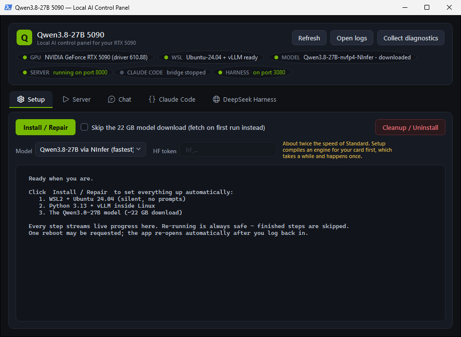
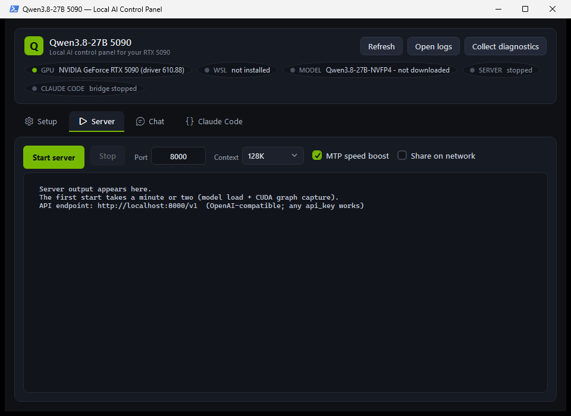
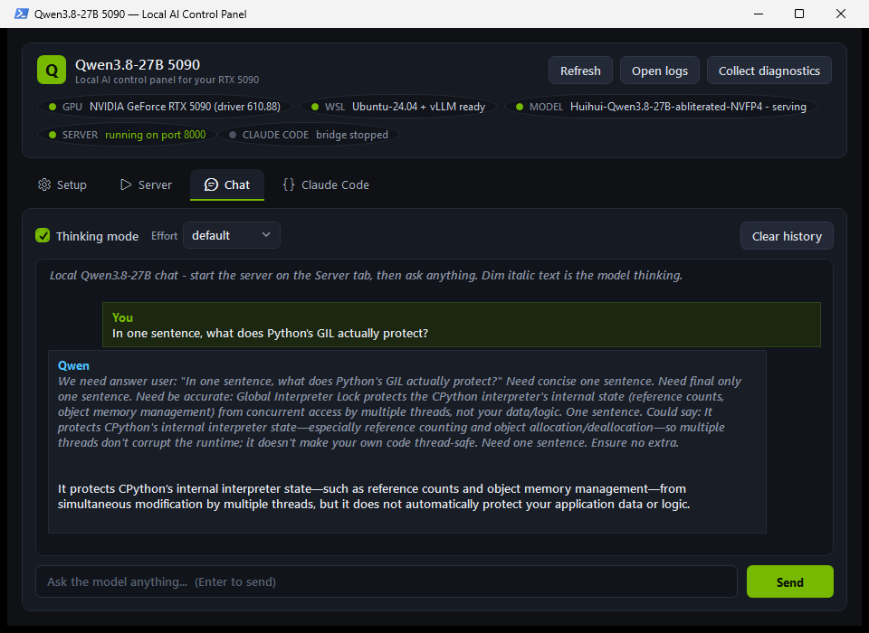
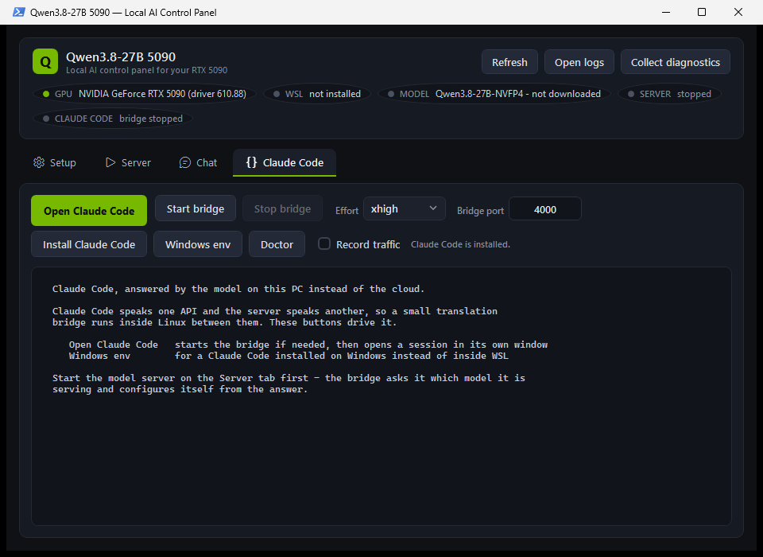
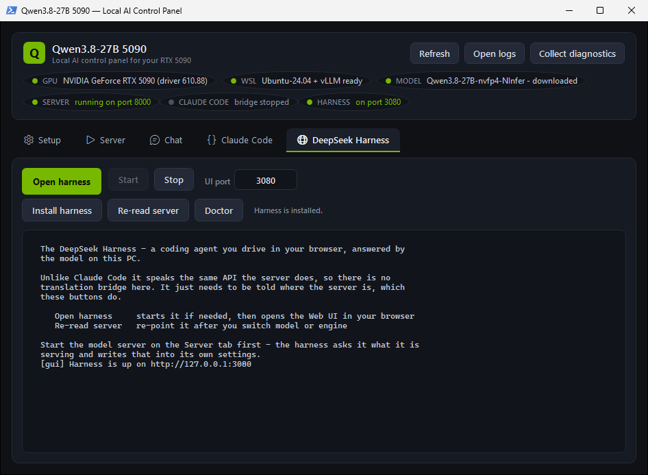

<div align="center">

<h1>Run Qwen3.8-27B (NVFP4) on a 5090 !</h1>

**Frontier-class coding AI, running entirely on your own hardware.**

No cloud · no subscription · no rate limits · nothing you type ever leaves your PC

**It takes one click on your Windows 11 PC.** Unzip, double-click, press
Install - the app sets up everything itself. When it finishes you can chat with
the model right there, and you can point
**[Claude Code](app/docs/CLAUDE-CODE.md)** straight at it: the same agent you
already know, answered by the GPU in your own machine.

[](LICENSE)
[](#get-started-3-steps)
[](app/docs/LINUX.md)
[](#why-nvfp4-on-a-5090)
[](https://huggingface.co/Qwen/Qwen3.8-27B)
[](https://github.com/vllm-project/vllm)

<br>

### [⬇️ &nbsp;DOWNLOAD ZIP&nbsp; ⬇️](https://github.com/Ark0N/Qwen5090/releases/latest/download/Qwen5090.zip)

[](https://github.com/Ark0N/Qwen5090/releases/latest/download/Qwen5090.zip)

**Unzip → double-click `Start Qwen 5090.cmd` → click Install. That's it.**



<sub><em>The control panel. One button installs WSL2, Ubuntu, the AI engine and the model.</em></sub>

<br>

**[Get started](#get-started-3-steps)** &nbsp;·&nbsp;
**[Benchmarks](#how-good-is-it)** &nbsp;·&nbsp;
**[Best coding agent](#which-coding-agent-works-best)** &nbsp;·&nbsp;
**[Requirements](#what-you-need)** &nbsp;·&nbsp;
**[Linux](#already-running-linux)** &nbsp;·&nbsp;
**[Coding agents](#use-it-as-a-coding-agent)** &nbsp;·&nbsp;
**[Power users](#for-power-users)** &nbsp;·&nbsp;
**[Troubleshooting](app/docs/TROUBLESHOOTING.md)**

</div>

---

The model is Qwen3.8-27B, and it is not a toy: on real-world bug fixing it
scores **61.7 against Claude Opus 4.6 Max's 53.4** — see
[How good is it?](#how-good-is-it) for the full table and the honest caveats.

## Get started (3 steps)

1. **[Download the ZIP](https://github.com/Ark0N/Qwen5090/releases/latest/download/Qwen5090.zip)**
   and unzip it anywhere (Desktop is fine).
   *Windows may flag the download: right-click the ZIP → Properties → tick
   **Unblock** before unzipping, and choose "More info → Run anyway" if
   SmartScreen asks.*
2. **Double-click `Start Qwen 5090.cmd`**, then click **Install / Repair** and approve
   the admin prompt. Everything is automatic: WSL2, Ubuntu, the AI engine, and
   the ~22 GB model download (15–40 min total). If Windows asks to reboot once,
   the app re-opens by itself afterwards — just click Install again to resume.
3. **Click Start server** on the Server tab, wait for the green light
   (a minute or two), and talk to your AI on the **Chat** tab.

You also get a **Qwen 5090** desktop shortcut, and an OpenAI-compatible API at
`http://localhost:8000/v1` that works with any AI app (Open WebUI, Continue,
Cline, ...) — API key can be anything.

## How good is it?

Qwen3.8-27B trades blows with the frontier commercial models on coding and
computer-use benchmarks — while being Apache 2.0 and running on hardware you
already own:

| Benchmark | Qwen3.8-27B | Claude Opus 4.6 Max |
|---|:---:|:---:|
| **SWE-bench Pro** — fixing real bugs in real repos | **61.7** | 53.4 |
| **LiveCodeBench v6** — competitive programming | **90.3** | 88.8 |
| **Terminal-Bench 2.1** — driving a shell | 73.0 | **78.2** |
| **OSWorld-Verified** — using a desktop | **84.3** | 72.7 |
| **AndroidWorld** — using a phone | **81.9** | 62.0 |

Scores are from the [official Qwen model card](https://huggingface.co/Qwen/Qwen3.8-27B).
Two things worth being straight about:

- **Opus still wins Terminal-Bench.** "Challenges the frontier" is the honest
  claim here, not "beats it at everything".
- **Those numbers are for the full-precision model.** This app ships the 4-bit
  NVFP4 quantisation, which is what makes 27B fit in 32 GB of VRAM at all — it
  costs some accuracy. Treat the table as the ceiling, not a promise.

## Which coding agent works best?

The model is only half of a coding agent. The other half is the **harness** that
drives it, and the harness you pick matters as much as the model. So we ran
[Terminal-Bench](https://www.tbench.ai/) ourselves, on **this** 4-bit quant,
across four different agents pointed at the same server with the same effort:

| Coding agent | Best score (Terminal-Bench subset) |
|---|:---:|
| **[DeepSeek Harness](app/docs/DEEPSEEK-HARNESS.md)** | **8 / 12** |
| **pi** | 7 / 12 |
| **[Claude Code](app/docs/CLAUDE-CODE.md)** | 7 / 12 |
| terminus | 7 / 12 |

The winner is the **DeepSeek Harness at medium reasoning effort, 8 / 12** — the
full ceiling of what this model can do on the subset, from one agent. The biggest
lesson was that **the best reasoning effort differs per agent** (the DeepSeek
Harness likes medium, terminus wants low, pi and Claude Code want high), so a
single "max effort" default leaves accuracy on the table. Almost every difference
between agents was fixable plumbing, not the model. Full per-task numbers, the
effort sweep, and the honest caveats:
**[Which coding agent is best on your 5090?](app/docs/HARNESS-BENCHMARKS.md)**

## What you need

| | |
|---|---|
| 💻 **OS** | Windows 11 — or **native Linux**, see [LINUX.md](app/docs/LINUX.md) |
| 🎮 **GPU** | NVIDIA RTX 5090 (other RTX 50-series with ≥24 GB also work) |
| 🔧 **Driver** | NVIDIA 570 or newer ([get the latest](https://www.nvidia.com/drivers)) |
| 🧠 **RAM** | 16 GB minimum, 32 GB recommended (the installer sizes WSL's share for you) |
| 💾 **Disk** | ~45 GB free (model ~22 GB, Python + CUDA libraries the rest) |

## What you get

- **A choice of builds**, picked from the **Model** dropdown on the Setup tab:
  the standard Qwen3.8-27B, or an **uncensored** (abliterated) build whose
  refusal behaviour has been removed — a plain public download, no account. See
  [Uncensored build](#uncensored-build); you answer for what you generate with
  it.
- **A faster engine, if you want it.** The same Qwen3.8-27B can be served by
  [NInfer](https://github.com/Neroued/ninfer) instead — a C++/CUDA engine built
  for the 5090 specifically. **About twice the speed**, and a very long
  document is read in seconds instead of minutes. It compiles itself during
  setup, which takes a while and happens once. See
  [Go faster with NInfer](#go-faster-with-ninfer).
- **The model**: Qwen3.8-27B — Alibaba's Apache-2.0, 27B multimodal model
  (released 2026-08-14) with 262K context and a reasoning dial, in NVIDIA's
  NVFP4 4-bit format built for your 5090's Blackwell tensor cores. Expect
  ~80 tokens/s at the default 128K context, or ~49 at the full 262K — see
  [PERFORMANCE.md](app/docs/PERFORMANCE.md).
- **Two coding agents, both talking to your own GPU.** Point
  [Claude Code](https://claude.com/claude-code) at it through a small bridge, or
  run the [DeepSeek Harness](https://github.com/deepseek-ai/deepseek-harness)
  (`dsh`) — DeepSeek's own agent runtime, with a browser UI, subagents and its
  own tool set. The harness needs no bridge at all, and one command points it at
  whichever engine you are running. Both read and write your files and run
  commands; nothing is billed and nothing leaves your network. See
  [Use it as a coding agent](#use-it-as-a-coding-agent).
- **A control panel** (pure Windows, no Electron): one-button install with live
  progress, server start/stop with health light, and streaming chat where the
  model's "thinking" renders dim. Thinking mode and effort (low → xhigh) are
  toggles, and **Share on network** makes the API usable from your other
  devices over Wi-Fi or [Tailscale](https://tailscale.com).
- **Logs & diagnostics**: every run is logged (`%LOCALAPPDATA%\Qwen5090\logs`
  on Windows, `~/.qwen5090/logs` in WSL). If anything breaks, click
  **Collect diagnostics** — it zips all logs + system info to your Desktop for
  a one-file bug report.
- **A clean exit**: **Cleanup / Uninstall** on the Setup tab removes everything
  the app installed — Ubuntu, the Python environment, and the ~22 GB model —
  freeing 20+ GB. Reinstalling later is one click.

<table>
<tr>
<td width="50%"></td>
<td width="50%"></td>
</tr>
<tr>
<td align="center"><em>Server tab — one click, then watch it come up.</em></td>
<td align="center"><em>Chat tab — the model's thinking renders dim above its answer.</em></td>
</tr>
</table>

## Already running Linux?

Everything above describes the Windows 11 experience, where one click builds a
WSL2 Ubuntu box because **vLLM only runs on Linux**. If your RTX 5090 is already
in a Linux machine, skip all of it — the scripts under `app/scripts/` are plain
bash and run directly:

```bash
git clone https://github.com/Ark0N/Qwen5090.git
cd Qwen5090
sudo apt-get install -y build-essential      # Triton needs a C compiler
bash app/scripts/setup-linux.sh              # venv + vLLM + model (~20 GB)
bash app/scripts/serve.sh                    # http://localhost:8000/v1
bash app/scripts/claude-code.sh install && qwen-claude   # Claude Code on your GPU
```

Or, with the [NInfer backend](app/docs/NINFER.md) installed, one command serves
the maintainer's production configuration — full 252,928-token window, MTP-3,
shared on the LAN/tailnet, identical to what the Windows box runs:

```bash
bash app/scripts/serve-full.sh               # see app/docs/LINUX.md
```

Prefer a browser to a terminal? The DeepSeek Harness runs here too, and on
Linux it is the simpler of the two — no bridge process, and it discovers the
model and context window by itself:

```bash
sudo apt-get install -y nodejs                    # 26.04 ships 22.22.1
bash app/scripts/deepseek-harness.sh install
bash app/scripts/deepseek-harness.sh start        # http://127.0.0.1:3080
```

Want it back after a reboot? `bash app/scripts/install-service.sh install`
writes a systemd user unit (no root needed), and
`bash app/scripts/deepseek-harness.sh service` does the same for the harness.

**Want the GUI's status pills?** There is no WPF on Linux, but there is a small
local web dashboard — model and backend, GPU utilisation, power against the
limit, temperature, VRAM and what is holding it, CPU per core, RAM and swap:

```bash
bash app/scripts/dashboard.sh                # http://127.0.0.1:8600
```

Read-only, standard library only, nothing to install.

No launcher, no WSL, and no GUI beyond that dashboard. Verified on Ubuntu 26.04
with an RTX 5090.
Full walkthrough — including the **262K-context + MTP** configuration that runs
at ~139 tok/s — in **[app/docs/LINUX.md](app/docs/LINUX.md)**.

## Go faster with NInfer

The Model dropdown has an entry called **Qwen3.8-27B via NInfer (fastest)**.
It is the same model as Standard — the same weights, the same answers — served
by a different engine.

|  | Standard (vLLM) | NInfer |
|---|---|---|
| Speed | ~80 words-ish/second | **~150–195** |
| Pasting a very long document | minutes, and it gives up past ~139K | **seconds** |
| Uncensored build available | yes | no |
| Setup | download and go | compiles an engine first (once) |

Tick it, click **Install**, and that is all — it is remembered, so every later
start uses it without touching anything. To go back, pick Standard again.

From a command line:

```powershell
.\app\install.ps1 -Ninfer     # Windows
```

```bash
bash app/scripts/setup-ninfer.sh   # Linux
```

Full detail — the other four models it can serve, the settings, and what to do
when the build cannot find a CUDA toolkit — is in
[NINFER.md](app/docs/NINFER.md).

## How it works

vLLM (currently the only engine that runs NVFP4) is Linux-only, so the
installer sets up **WSL2 + Ubuntu 24.04** — Microsoft's built-in Linux layer —
completely silently: no Linux prompts, a `qwen` user is created for you, and
your Windows NVIDIA driver powers the GPU inside WSL automatically. The
PowerShell scripts hide all of it; `localhost:8000` just works.

```
you ──► Start Qwen 5090.cmd ──► gui.ps1 ──► install.ps1 / run.ps1
                                                 │
                                      WSL2 · Ubuntu 24.04
                                                 │
                                  serve.sh ──► vLLM ──► your RTX 5090
                                                 │
                                   OpenAI API · localhost:8000/v1
```

What `install.ps1` actually does: checks Windows 11 + driver ≥ 570 → raises the
GPU watchdog timeout, which needs one restart → enables WSL2 (one reboot max,
auto-resumes) → provisions Ubuntu unattended → installs `build-essential`
(vLLM's kernel compiler needs a C compiler at runtime) → creates a Python 3.13
venv with `vllm`, `flashinfer`, and the CUTLASS DSL → downloads
[`unsloth/Qwen3.8-27B-NVFP4`](https://huggingface.co/unsloth/Qwen3.8-27B-NVFP4)
(~22 GB, skippable) → desktop shortcut. Re-running is always safe.

<a id="claude-code"></a>

## Use it as a coding agent

Two clients work against this server, and you can have both installed at once —
they are ordinary API clients, so neither touches the serving path. **Claude
Code** is below; **[the DeepSeek Harness](#or-the-deepseek-harness)** is the
browser-based alternative that needs no bridge.

> **Which one is best?** We benchmarked four harnesses (DeepSeek Harness, pi,
> Claude Code, and Terminal-Bench's terminus) on the same model and the same
> tasks. Short version: pi and the DeepSeek Harness give the best result for the
> least fuss, and after tuning three of the four tie. Full numbers and the honest
> caveats: **[Which coding agent is best on your 5090?](app/docs/HARNESS-BENCHMARKS.md)**

### Claude Code

Point [Claude Code](https://claude.com/claude-code) at this server and it reads
and writes your files, runs commands and edits code exactly as it normally does
— with no Anthropic account, nothing billed, and nothing leaving your network.

Claude Code speaks the **Anthropic** API; vLLM serves the **OpenAI** API and has
no `/v1/messages` endpoint at all. Neither side bends, so a small
[LiteLLM](https://github.com/BerriAI/litellm) process sits between them and
translates in both directions — streaming, tool calls and token counting
included:

```
claude ──Anthropic /v1/messages──► bridge :4000 ──OpenAI /v1──► vLLM :8000
                                  (LiteLLM)                     (your 5090)
```

The bridge installs itself on first run and reads `/v1/models` to configure
itself, so it follows whichever checkpoint you are serving — nothing to keep in
sync. Claude Code itself installs the same way: the first session you open
fetches it (about 30 seconds, no account, no Node.js), or click **Install Claude
Code** on that tab to get it over with first.

**On the same PC as the server.** Start the server first, then open the app's
**Claude Code** tab and click **Open Claude Code** — it starts the bridge and
opens a session in its own window. **Windows env** on the same tab is for a
Claude Code installed on Windows rather than inside WSL: it copies the variables
that one needs to the clipboard.

<div align="center">

</div>

The same thing from PowerShell, if you prefer:

```powershell
.\app\claude-code.ps1              # opens Claude Code inside WSL
.\app\claude-code.ps1 -Start       # just the bridge, no session
.\app\claude-code.ps1 -Windows     # prints the env vars for a Windows-native Claude Code
```

**From another machine** — a laptop, a Mac, another WSL box — the API has to be
reachable off localhost first, so tick **Share on network** or run
`.\app\share.ps1` on the 5090 PC. Then, on the machine you want to code from:

```bash
QWEN_URL=http://<5090-ip>:8000 bash app/scripts/claude-code.sh install
qwen-claude                        # from any directory, from now on
```

Over Tailscale, `<5090-ip>` is the PC's Tailscale IP (`tailscale ip -4`) or its
MagicDNS name — so this works from anywhere, not just your own Wi-Fi. The client
machine needs nothing from this repo except `app/scripts/claude-code.sh`.

`install` bakes that URL into a `qwen-claude` command on your PATH; it is
optional — `bash app/scripts/claude-code.sh run` does the same thing without
installing anything, and `uninstall` reverses it. `qwen-claude status|stop|doctor`
manage the bridge, and `doctor` fires a real end-to-end request when something
looks off.

### Where the big files go

The DeepSeek builds are 63 to 105 GB, so `serve-gguf.ps1` puts them — and
llama.cpp itself — on **E:** by default, not on C:. Override with `-ModelDir`,
or point `QWEN5090_DRIVE` at another letter; if E: is missing it falls back to
whichever fixed drive has the most room and says so.

The WSL half is different: the venv and the Qwen weights live *inside* the
distro's virtual disk. A **fresh** install puts that disk on the big drive too
(`E:\Qwen5090\wsl\`, same `QWEN5090_DRIVE` override; a C:-only PC keeps WSL's
default, and `install.ps1 -DistroLocation` picks any directory you like).
For a distro that is **already installed** on C:, pointing `HF_HOME` at
`/mnt/e` looks like the fix and is a trap — vLLM maps each weight shard with a
private, **writable** mmap, which is exactly what Windows-drive filesystems
cannot do from inside WSL. Move the whole distro instead:

```powershell
.\app\move-to-drive.ps1 -Drive E:          # show what it would do
.\app\move-to-drive.ps1 -Drive E: -Apply   # export, unregister, re-import
```

It refuses while a server is running, keeps the export until the new copy has
started and answered, and restores the default user — an imported distro
otherwise comes back as root, which breaks every script here.

### Or the DeepSeek Harness

[DeepSeek Harness](https://github.com/deepseek-ai/deepseek-harness) (`dsh`) is
DeepSeek's own open-source agent runtime, and it speaks the OpenAI API
natively — so it needs no bridge at all, just a provider route. You work in a
browser rather than a terminal, and it brings subagents and its own tool set.

On the 5090 PC it is one button: start the model server, open the app's
**DeepSeek Harness** tab, and click **Open harness** — it installs Node.js and
the harness on first use (each with its own yes/no), starts it, and opens the
Web UI in your browser.

<div align="center">

</div>

The same thing from a shell — including a machine that is not the 5090:

```bash
bash app/scripts/deepseek-harness.sh install
QWEN_URL=http://<5090-ip>:8000 bash app/scripts/deepseek-harness.sh start
```

That serves its Web UI on <http://127.0.0.1:3080>. `service` keeps it running
across reboots and `share` publishes it to your tailnet over HTTPS. Details,
and the five settings that decide whether the requests are accepted at all, in
**[app/docs/DEEPSEEK-HARNESS.md](app/docs/DEEPSEEK-HARNESS.md)**.

It follows whatever is serving on port 8000 — vLLM or NInfer — without being
told which: `config` reads that off the server and adjusts the route to match.
On NInfer it also probes the real context window, because that backend does not
publish one, and offers an `off` thinking tier that the vLLM path does not
have. If you run it there, `MAX_SEQS=1` is worth raising to 2 in
`~/.qwen5090/server.env`: the harness runs subagents, and at 1 they queue
behind each other.

Expect a capable local assistant rather than a frontier one: well-scoped edits,
refactors and file spelunking go fine; long multi-step planning is weaker, and
it thinks for a few seconds before each reply (`QWEN_EFFORT=medium` trades some
of that back). Full guide, settings and troubleshooting:
**[app/docs/DEEPSEEK-HARNESS.md](app/docs/DEEPSEEK-HARNESS.md)**.

**It has also tuned this very stack.** Pointed at a copy of this repo, the
harness built `app/optimization/` — an autonomous loop that benchmarks and
tunes its own settings *and* the live server's flags on the one GPU they
share, with health probes, quiet-window swaps and automatic rollback. Its
first findings (a reasoning-effort sweet spot, a serving flag promoted on a
16/16 run, and two impossible configs rejected safely) are written up in
**[app/docs/SELF-OPTIMIZATION.md](app/docs/SELF-OPTIMIZATION.md)**.

## For power users

<details>
<summary><b>Command line</b> — every button the GUI has, as a script</summary>

<br>

Elevated PowerShell for install; scripts live in `app\`:

```powershell
.\app\install.ps1    # everything the GUI does; add -SkipDownload / -Unattended
.\app\install.ps1 -Ninfer         # the NInfer backend instead: ~2x faster, compiles an engine
.\app\install.ps1 -WslMemoryOnly   # only re-size the WSL VM from this PC's RAM
.\app\run.ps1        # serve on http://localhost:8000/v1
.\app\chat.ps1       # terminal chat (second terminal)
.\app\uninstall.ps1  # remove the distro, env, and model (what the Cleanup button runs)
```

On native Linux (no PowerShell, no WSL — see [LINUX.md](app/docs/LINUX.md)):

```bash
bash app/scripts/setup-linux.sh     # one-time: venv + vLLM + model
bash app/scripts/serve.sh           # serve on http://localhost:8000/v1
bash app/scripts/chat.py            # terminal chat
bash app/scripts/claude-code.sh run # Claude Code against this server
bash app/scripts/patch-mtp.sh apply # opt-in: MTP at the full 262K window
bash app/scripts/setup-ninfer.sh    # opt-in: the NInfer backend, ~2x faster
bash app/scripts/install-service.sh install   # start automatically at boot
```

> **First time in a PowerShell window?** Windows blocks these scripts with
> *"…is not digitally signed"* — GitHub's ZIP marks every file as
> downloaded-from-the-internet. The double-click launcher passes
> `-ExecutionPolicy Bypass` so it never sees this; run them by hand and you do.
> Once per window:
>
> ```powershell
> Set-ExecutionPolicy -Scope Process -ExecutionPolicy Bypass -Force
> ```
>
> Or permanently, from the unzipped folder: `Get-ChildItem -Recurse | Unblock-File`.

</details>

<details>
<summary><b>Tuning</b> — context, VRAM share, speculative decoding</summary>

<br>

| Knob | Default | Notes |
|---|---|---|
| `run.ps1 -Ctx` | `131072` | Context window. 128K is the largest that still holds a higher-precision fp8 KV cache in 32 GB, which keeps MTP on and runs ~80 tok/s. `262144` is the model's native maximum, but above 128K the KV cache switches to 4-bit so it fits, which also turns MTP off (the two together corrupt the output) — so the full window runs at ~49 tok/s. Use `65536` if you are gaming at the same time. |
| `run.ps1 -Port` | `8000` | API port. |
| `run.ps1 -GpuUtil` | `0.90`, or `0.85` above 128K | Fraction of VRAM the server may claim. The Windows desktop shares the GPU, and at the full 262K window the 4-bit cache has capacity to spare — so it keeps a little more back for Windows there. Only pass this if you know you need to. |
| `run.ps1 -NoMtp` | off | Disables speculative decoding if it misbehaves. |
| `run.ps1 -PrefixCache` | on above 128K | Reuses the KV of a repeated prompt prefix instead of recomputing it. Above 128K a second request sharing a 32K prefix answered in 0.31 s against 3.80 s cold — worth most to agent tools like Claude Code, which resend the same long system prompt every turn. `-PrefixCache:$false` turns it off. |
| `run.ps1 -Uncensored` | off | Serves the abliterated build instead (install it first). |
| `run.ps1 -Model` | `unsloth/Qwen3.8-27B-NVFP4` | Any Hugging Face repo id or a path inside WSL. |
| `chat.ps1 -NoThink` | off | Direct answers, no reasoning tokens. |
| `chat.ps1 -Effort low\|medium\|xhigh` | model default | Qwen3.8's reasoning-effort dial. The chat template rejects every other value, `high` included. |

</details>

<details>
<summary><b>API example</b> — it is just the OpenAI SDK</summary>

<br>

Recommended sampling: temperature 0.7, top-p 0.8, top-k 20, presence 1.5.

```python
from openai import OpenAI
client = OpenAI(base_url="http://localhost:8000/v1", api_key="local")
resp = client.chat.completions.create(
    model="unsloth/Qwen3.8-27B-NVFP4",
    messages=[{"role": "user", "content": "Explain NVFP4 in one paragraph."}],
    extra_body={"chat_template_kwargs": {"enable_thinking": False}},
)
print(resp.choices[0].message.content)
```

Tool calling and the `qwen3` reasoning parser are enabled on the server.
Quick benchmark while it runs (from WSL): `bash app/scripts/benchmark.sh`

</details>

<a id="uncensored-build"></a>

<details>
<summary><b>Uncensored build</b> — abliterated, no account, no guardrails</summary>

<br>

Pick *Uncensored (abliterated)* in the Setup tab's **Model** dropdown, or from
PowerShell:

```powershell
.\app\install.ps1 -Uncensored   # one-time download (~19 GB), no account needed
.\app\run.ps1 -Uncensored       # serve it
.\app\run.ps1                   # back to the standard build
```

That is [`sakamakismile/Huihui-Qwen3.8-27B-abliterated-NVFP4`](https://huggingface.co/sakamakismile/Huihui-Qwen3.8-27B-abliterated-NVFP4) —
[huihui-ai's abliterated Qwen3.8-27B](https://huggingface.co/huihui-ai/Huihui-Qwen3.8-27B-abliterated)
re-quantized to NVFP4 with llm-compressor, Apache-2.0, MTP head preserved. It
is a **public download**: no Hugging Face account, no token. At ~19 GB it is
smaller than the standard build, so there is more room for KV cache.

> ⚠️ It has **no safety guardrails**. It answers what the standard model
> declines, including things that are illegal or dangerous to act on, and it is
> no more accurate while doing so — abliteration removes refusals, not mistakes.
> What you do with the output is on you.

Both builds run entirely on your PC. The author also notes it occasionally drops
a closing parenthesis when generating code.

A third entry, *Uncensored - OrcaRouter (sign-in)*
([`orcarouter/Qwen3.8-27B-Uncensored-NVFP4`](https://huggingface.co/orcarouter/Qwen3.8-27B-Uncensored-NVFP4),
~23 GB), is a different abliteration of the same model. It is **gated**: sign in
at Hugging Face, accept the terms on the model page, create a **read** token at
[huggingface.co/settings/tokens](https://huggingface.co/settings/tokens), and
paste it into the **HF token** box that lights up next to the dropdown. Stored
inside WSL, so you do it once.

Any other checkpoint works too: `run.ps1 -Model owner/name` (add
`install.ps1 -Model owner/name` to download it). Serving flags follow the model
id automatically — `serve.sh` knows which builds take `--kv-cache-dtype` from
the command line versus their own `config.json`, how many MTP tokens to draft,
and which need `--trust-remote-code`.

</details>

<details>
<summary><b>Use it from your phone or laptop</b> — LAN and Tailscale</summary>

<br>

Tick **Share on network** on the Server tab (one admin prompt per start), or run
`.\app\run.ps1 -Share`. Any device on your Wi-Fi or tailnet can then use
`http://<this-PC's-IP>:8000/v1` — for Tailscale, use the PC's Tailscale IP
(`tailscale ip -4`) or MagicDNS name. Sharing forwards the port out of WSL and
opens Windows Firewall on Private/Domain networks only (Tailscale counts as
private; public Wi-Fi stays blocked).

> ⚠️ **The API has no authentication**, so only share on networks you trust.

Undo anytime: `.\app\share.ps1 -Remove`. HTTPS alternative with zero setup:
`tailscale serve --bg 8000`.

</details>

<a id="why-nvfp4-on-a-5090"></a>

**Why NVFP4 on a 5090:** the ~22 GB weights fit the 32 GB card with room for
a 128K context at fp8 — or the full 262K with a 4-bit KV cache, thanks to
Qwen3.8's hybrid attention. It runs ~1.5× faster than BF16 on Blackwell's FP4
tensor cores, and Unsloth's dynamic quants keep accuracy close to the original
checkpoint.

## Repo layout

```
Start Qwen 5090.cmd        ← double-click this — it's all most people need
README.md                  this file
app/                       everything under the hood:
  gui.ps1                    WPF control panel (install / server / chat)
  install.ps1                one-shot installer (also used headless by the GUI)
  run.ps1                    start the vLLM server (CLI)
  chat.ps1                   terminal chat client (CLI)
  share.ps1                  expose the API to LAN/Tailscale (used by -Share)
  uninstall.ps1              remove everything (distro + model); GUI 'Cleanup' button
  collect-logs.ps1           zip all logs + system state for bug reports
  claude-code.ps1            run Claude Code against this server
  scripts/                   the Linux side — runs under WSL *and* on native Linux:
    setup-linux.sh             one-time setup on a Linux box (wraps setup-wsl.sh)
    setup-wsl.sh               venv + vLLM + model download (what install.ps1 runs)
    serve.sh                   vLLM with 5090-tuned flags; dispatches to the others
    setup-ninfer.sh            opt-in: build the NInfer engine + fetch its artifact
    serve-ninfer.sh            NInfer, the fast backend (same port, same API)
    serve-full.sh              one command: the production NInfer config, full window
    serve-gguf.sh              llama.cpp, for the DeepSeek GGUF builds
    claude-code.sh             the Claude Code bridge (LiteLLM)
    deepseek-harness.sh        the DeepSeek Harness (dsh): install, route, Web UI
    terminal-bench.sh          run Terminal-Bench 2.1 against this server
    tb_dsh_agent.py            the harness adapter Terminal-Bench drives
    patch-mtp.sh               opt-in vLLM PR #40914 backport: MTP at 262K ctx
    install-service.sh         systemd user unit so the server survives reboot
    dashboard.sh, dashboard.py the Linux status page (model, GPU, CPU, memory)
    fan-curve.sh               drive the chassis fans off GPU temperature
    chat.py, benchmark.sh      clients against the OpenAI endpoint
    lib-*.sh                   shared helpers (build tools, model catalog,
                               NInfer, GPU telemetry, WSL/Linux detection)
  templates/                 chat templates (DeepSeek V4 + Hermes tool calls)
  optimization/              the harness's autonomous tuning loop (see
                             docs/SELF-OPTIMIZATION.md); state stays local
  docs/                      troubleshooting, performance, Claude Code,
                             DeepSeek Harness, Linux, NInfer
    images/                    control-panel screenshots used by this README
```

## Something not working?

| Guide | What is in it |
|---|---|
| **[TROUBLESHOOTING.md](app/docs/TROUBLESHOOTING.md)** | Install failures, GPU not found, out of memory, crashes |
| **[PERFORMANCE.md](app/docs/PERFORMANCE.md)** | Measured throughput, context/speed trade-offs, tuning |
| **[CLAUDE-CODE.md](app/docs/CLAUDE-CODE.md)** | The bridge, its settings, and what works versus what does not |
| **[DEEPSEEK-HARNESS.md](app/docs/DEEPSEEK-HARNESS.md)** | The dsh agent runtime: install, routes, Web UI, headless mode |
| **[SELF-OPTIMIZATION.md](app/docs/SELF-OPTIMIZATION.md)** | The autonomous tuning loop: results, caveats, roadmap |
| **[NINFER.md](app/docs/NINFER.md)** | The NInfer backend: what it is faster at, knobs, build issues |
| **[LINUX.md](app/docs/LINUX.md)** | Native Linux install, systemd, the 262K + MTP path |

Still stuck? Click **Collect diagnostics** in the app — it puts a single ZIP of
all logs and system state on your Desktop, which is exactly what an issue report
needs.

## Credits & license

- [Qwen team](https://huggingface.co/Qwen) — Qwen3.8-27B (Apache 2.0)
- [Unsloth](https://unsloth.ai) — dynamic NVFP4 quantization
- [vLLM](https://github.com/vllm-project/vllm) — inference engine
- [NInfer](https://github.com/Neroued/ninfer) by [Neroued](https://github.com/Neroued) — the optional fast backend, and its `.ninfer` artifacts (Apache 2.0)
- [huihui-ai](https://huggingface.co/huihui-ai) and [sakamakismile](https://huggingface.co/sakamakismile) — the abliterated build
- [MiaAI-Lab](https://github.com/MiaAI-Lab/Qwen3.8-27B-NVFP4-RTX-5090) — the MTP-at-262K patch this repo backports

Tooling in this repo is [MIT-licensed](LICENSE). Not affiliated with Alibaba,
Unsloth, NVIDIA, the vLLM project, or NInfer.
